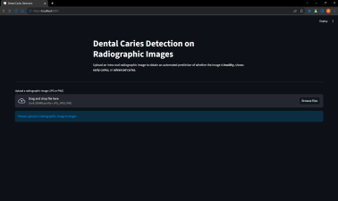
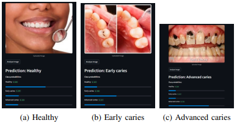

# Dental Caries Detection with VGG16 Transfer Learning

## 📸 Preview

### Application Interface


### Prediction Example



Deep learning system that detects dental caries from radiographic images using a **VGG16 transfer learning model**.  
The project integrates image preprocessing, CNN training, and a Streamlit web application for real-time clinical decision support.


## Features
- Transfer Learning with **VGG16**
- CLAHE contrast enhancement for improved radiograph clarity
- Multi-class classification:
  - Healthy
  - Early Caries
  - Advanced Caries
- Interactive **Streamlit** interface
- End-to-end deep learning pipeline


## Tech Stack
**Python • TensorFlow/Keras • OpenCV • Streamlit • NumPy**


## Project Structure

app.py # Streamlit application
train_model.ipynb # Model training pipeline
requirements.txt


## Run Locally
```bash
pip install -r requirements.txt
streamlit run app.py


# Model

The trained model is available upon request.


# Objective

This project demonstrates how deep learning can assist dentists by acting as a decision-support tool for early detection of dental caries.

# Author

Abdulraheem Al-Ani
Computer Engineering (AI) — Abu Dhabi University
(https://www.linkedin.com/in/abdulraheem-alani/)


